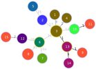

Microbial Informatics 2014 Labs
===============================

Welcome to the Microbial Informatics 2014 labs.  This page contains a number of tutorials on performing data analysis on whole genome sequencing data for the [Microbial Informatics][workshop-2014] workshop hosted at the National Microbiology Laboratory in Winnipeg, Canada.  These labs can be accessed online at <https://github.com/apetkau/microbial-informatics-2014>.

Introduction
------------

The data for these labs is a set of whole genome sequencing data from a number of *V. Cholerae* strains from the [outbreak of cholera in Haiti][haiti-cholera] beginning in 2010 as well as a number of other *V. cholerae* strains included for comparison.  This data was previously published in <http://mbio.asm.org/content/4/4/e00398-13.abstract> and <http://mbio.asm.org/content/2/4/e00157-11.abstract> and is available on NCBI's [Sequence Read Archive](http://www.ncbi.nlm.nih.gov/sra/).  A table of the specific data used within this lab is given below.

| Strain       | Location                                  | Year  | NCBI Accession                                        |
|:------------:|:-----------------------------------------:|:-----:|:-----------------------------------------------------:|
| 2010EL-1786  | Haiti                                     | 2010  | [NC_016445.1][NC_016445.1],[NC_016446.1][NC_016446.1] |
| 2010EL-1749  | Cameroon                                  | 2010  | [SRR773655][SRR773655]                                |
| 2010EL-1796  | Haiti                                     | 2010  | [SRR771582][SRR771582]                                |
| 2010EL-1798  | Haiti                                     | 2010  | [SRR074109][SRR074109]                                |
| 2011EL-2317  | Haiti                                     | 2011  | [SRR773175][SRR773175]                                |
| 2012V-1001   | United States                             | 2011  | [SRR892331][SRR892331]                                |
| 3554-08      | Nepal                                     | 2008  | [SRR774919][SRR774919]                                |
| C6706        | Peru                                      | 1991  | [SRR774920][SRR774920]                                |
| VC-1         | Banke district, Nepalgunj municipality    | 2010  | [SRR308665][SRR308665]                                |
| VC-10        | Banke district, Nepalgunj municipality    | 2010  | [SRR308707][SRR308707]                                |
| VC-14        | Banke district, Nepalgunj municipality    | 2010  | [SRR308715][SRR308715]                                |
| VC-15        | Dang Deokhuri district, Narayanpur VDC    | 2010  | [SRR308716][SRR308716]                                |
| VC-18        | Banke district, Nepalgunj municipality    | 2010  | [SRR308721][SRR308721]                                |
| VC-19        | Kathmandu district, Kathmandu city        | 2010  | [SRR308722][SRR308722]                                |
| VC-25        | Rupandehi district, Butawal municipality  | 2010  | [SRR308726][SRR308726]                                |
| VC-26        | Rupandehi district, Butawal municipality  | 2010  | [SRR308727][SRR308727]                                |
| VC-6         | Banke district, Nepalgunj municipality    | 2010  | [SRR308703][SRR308703]                                |

These labs will go through data analysis on the above strains.  We will not reproduce the exact types of figures from the publications but the labs should help in getting started working with microbial whole genome sequence data.

These labs assume that you are familar working within a Linux environment using the command line.

Running the Labs
----------------

### Virtual Machine

All necessary software to run these labs is provided in the form of a customized Ubuntu virtual machine.  You will need to install software such as [Oracle Virtual Box](https://www.virtualbox.org/) in order to run the virtual machine.  Please see the [Workshop Software](https://www.corefacility.ca/wiki/bin/view/BioinformaticsWorkshop/Software2014) instructions for more details.

### Data

The data for these labs is provided separately in the file **microbial-informatics-2014-data.tar.bz2** and can be downloaded from https://share.corefacility.ca/public.php?service=files&t=2fb62f38f4828897ca24efe8fc181a0c.  This is approximetly 1.1 GB.  Please download this file from within the Virtual Machine.  Once downloaded, the data can be extracted to a directory, **Course/** with the following command.

```bash
$ tar -xvvjf microbial-informatics-2014-data.tar.bz2
```

For the remainder of these labs, please adjust any references to **/Course** with the directory that was just extracted.  For example, if the files were extacted within the **Downloads** directory and a command is given to copy files from **/Course** please copy the files from **~/Downloads/Course**.

### Instructions

Once the virtual machine is running and the data is downloaded, the instructions for these labs can be obtained by running the following.

```bash
$ git clone https://github.com/apetkau/microbial-informatics-2014.git
```

This will copy all the instructions and other needed files to a directory, **microbial-informatics-2014/**.

Labs
----

| Day 6: May 14, 2014                                                         | Day 7: May 15, 2014                                                           |
|:---------------------------------------------------------------------------:|:-----------------------------------------------------------------------------:|
| **8:45-10:15 am:** [Ortholog detection with OrthoMCL](labs/orthomcl)        | **12:30-2:00 pm:** [Whole Genome SNP Phylogenomics](labs/core-snp)            |
|   |     |
|                                                                             |                                                                               |
| **10:30-12:15 pm:** [Working with GView Server](labs/gview-server)          | **2:15-3:15 pm:** [Feature Frequency Profile Phylogenies](labs/ffp-phylogeny) |
|       |                          |
|                                                                             |                                                                               |
| **3:00-4:45 pm:** [Minimum Spanning Trees with PHYLOViZ](labs/mst)          |                                                                               |
|            |                                                                               |

[workshop-2014]: https://www.corefacility.ca/wiki/bin/view/BioinformaticsWorkshop/WorkshopMay2014
[haiti-cholera]: http://en.wikipedia.org/wiki/2010%E2%80%9313_Haiti_cholera_outbreak

[NC_016445.1]: http://www.ncbi.nlm.nih.gov/nuccore/NC_016445.1
[NC_016446.1]: http://www.ncbi.nlm.nih.gov/nuccore/NC_016446.1
[SRR773655]: http://www.ncbi.nlm.nih.gov/sra/?term=SRR773655
[SRR771582]: http://www.ncbi.nlm.nih.gov/sra/?term=SRR771582
[SRR074109]: http://www.ncbi.nlm.nih.gov/sra/?term=SRR074109
[SRR773175]: http://www.ncbi.nlm.nih.gov/sra/?term=SRR773175
[SRR892331]: http://www.ncbi.nlm.nih.gov/sra/?term=SRR892331
[SRR774919]: http://www.ncbi.nlm.nih.gov/sra/?term=SRR774919
[SRR774920]: http://www.ncbi.nlm.nih.gov/sra/?term=SRR774920
[SRR308665]: http://www.ncbi.nlm.nih.gov/sra/?term=SRR308665
[SRR308707]: http://www.ncbi.nlm.nih.gov/sra/?term=SRR308707
[SRR308715]: http://www.ncbi.nlm.nih.gov/sra/?term=SRR308715
[SRR308716]: http://www.ncbi.nlm.nih.gov/sra/?term=SRR308716
[SRR308721]: http://www.ncbi.nlm.nih.gov/sra/?term=SRR308721
[SRR308722]: http://www.ncbi.nlm.nih.gov/sra/?term=SRR308722
[SRR308726]: http://www.ncbi.nlm.nih.gov/sra/?term=SRR308726
[SRR308727]: http://www.ncbi.nlm.nih.gov/sra/?term=SRR308727
[SRR308703]: http://www.ncbi.nlm.nih.gov/sra/?term=SRR308703
