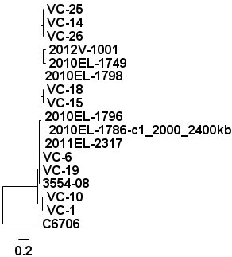
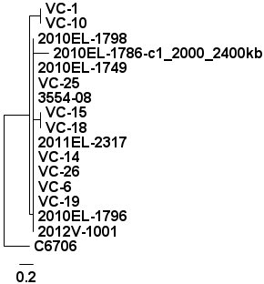
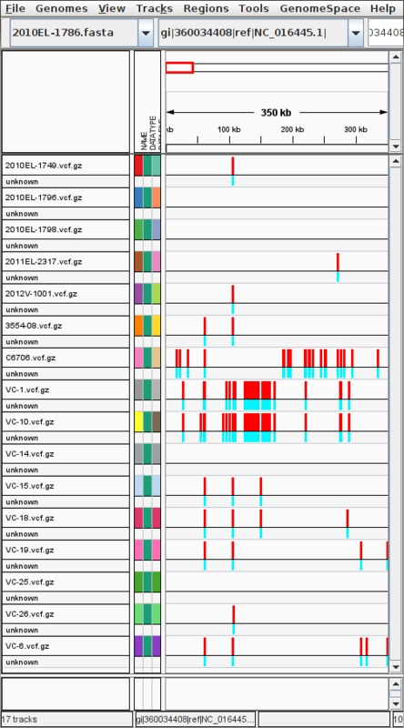

Whole Genome SNP Phylogenomics: Answers
=======================================

Question 1
----------

To change the minimum coverage from *2* to *5* please create a new file, *mapping.5.conf* and modify the *min_coverage* section to the following.

```
%YAML 1.1
---
min_coverage: 5
...
```

To re-run the phylogenetic pipeline please use the following commands.

```bash
$ snp_phylogenomics_control --mode mapping --input-dir cholera-files-subsample/fastq/ \
   --reference cholera-files-subsample/reference/2010EL-1786-c1_2000_2400kb.fasta \
   --output output-10-subsample-5 --config mapping.5.conf
```

To find the total number of **valid** positions used please run.

```bash
$ grep --count -P "\tvalid\t" output-10-subsample-5/pseudoalign/pseudoalign-positions.tsv
10
```

The following table compares both phylogenetic trees generated with the different minimum coverage values.
   
| Minimum Coverage | Valid Positions | Phylogenetic Tree                                              |
|:----------------:|:---------------:|:--------------------------------------------------------------:|
| 2                | 28              |      |
| 5                | 10              |  |

The difference between the tree where the minimum coverage is 2 and the tree where the minimum coverage is 5 is that with a minimum coverage of 5 the tree appears a bit flatter since there are less positions avaiable to differentiate some of the samples.

Question 2
----------

### Part A

The phylogenetic tree generated from the whole genome looks as follows.


The total number of variants used to generate this tree can be obtained using.

```bash
$ grep --count -P "\tvalid\t" output-10-example/pseudoalign/pseudoalign-positions.tsv
360
```

This is over 10x the number of positions used when mapping to the 400kbp fragment of the genome.  This is reflected in the phylogenetic tree, which shows a bit more separation between the samples.

### Part B

To index the VCF files, please run the following commands.

```bash
$ cd output-10-example/vcf
$ for i in *.vcf; do bgzip $i; done
$ for i in *.vcf.gz; do tabix -p vcf $i; done
```

Loading up these files in IGV will look as follows.



The main difference from the files in **Lab 2** is that all variants across the genome are displayed here.
