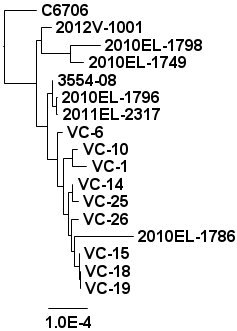
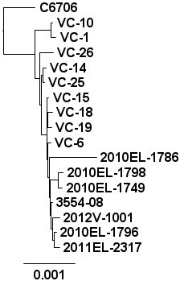
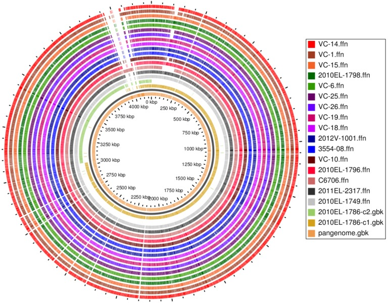

Answers
=======

Answer 1
--------

Running ffp with a kmer length of 10, 15, or 20 will generate a more diverse profile for each genome, but at the cost of taking longer to run.  The following table describes the running time and resulting trees.

| K-mer Length | Time (s) | Result                             |
|:------------:|:--------:|:----------------------------------:|
| 5            | 2.7      |    |
| 10           | 2.7      |  |
| 15           | 5.7      |  |
| 20           | 131      |  |

Notice how the branch lengths are increasing and the genomes are beginning to visibly cluster as the kmer length increases.

Answer 2
--------

| K-mer Length | Time (s) | Result                                     |
|:------------:|:--------:|:------------------------------------------:|
| 5            | 2.9      |    |
| 10           | 113      |  |

Note: The publication at http://www.ncbi.nlm.nih.gov/pmc/articles/PMC2806744/ describes a method for selecting the best parameters and also shows that the trees will converge quickly to a stable solution as the k-mer length increases.  They also describe a method for computing statistical support for the branching order of the major groups.  Also, see the publication http://www.pnas.org/content/108/20/8329.

Answer 3
--------

Constructing the amio acid sequence-based tree can be accomplished with the following.

```bash
$ ffpaa -l 5 annotations/*.faa | ffpcol -a | ffprwn | ffpjsd -p genome_names_faa.txt | ffptree > tree-5-aa.txt
```

This generates a tree that should look similar to below.



Some differences are that the amino acid sequence tree separates some of the branches of the tree a bit more visibly and the branch lengths are quite a bit shorter (especially those between VC-6, VC-10, VC-14, and the rest).

Answer 4
--------

The core feature tree generated from a k-mer length of 20 looks like.



This core feature phylogeny would exclude any regions that are not part of the core genome.  That is, regions where there are gaps in the pan-genome BLAST Atlas.  Some of the larger such regions include:

* ~100 kbp on the pan-genome BLAST Atlas where C6706 has the largest region missing, and VC-10,VC-26,VC-25,VC-15,VC-1 all have smaller gaps.
* ~4000 kbp on the pan-genome BLAST Atlas where C6706 has a large unique region, and VC-10, VC-1 have smaller unique regions.

 

