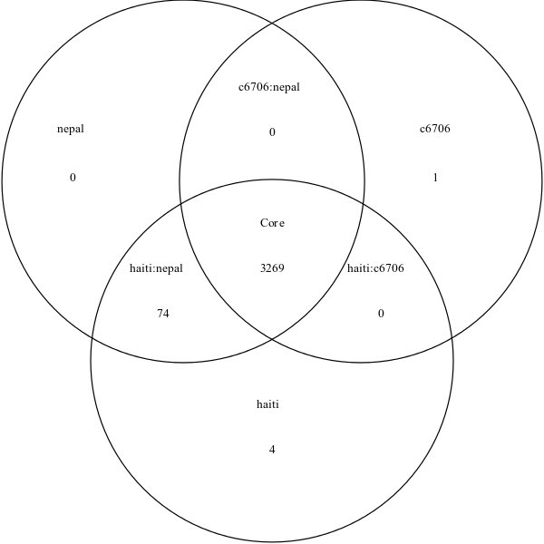

Ortholog Detection with OrthoMCL: Answers
=========================================

Question 1
----------

The products for the other genes can be obtained with the following commands:

```bash
$ grep '2010EL-1796_03119' annotations-small/*.fasta
annotations-small/2010EL-1796.fasta:>2010EL-1796_03119 DNA polymerase V subunit UmuC

$ grep 'VC-10_00387' annotations-small/*.fasta
annotations-small/VC-10.fasta:>VC-10_00387 DNA polymerase V subunit UmuC

$ grep 'Vch1786_I0090' annotations-small/*.fasta
annotations-small/2010EL-1786.fasta:>Vch1786_I0090 [cholerae O1 str. 2010EL-1786] 
error-prone repair protein UmuC
```

These are all the same except for **Vch1786_I0090** which is found within **2010EL-1786**.  This is because this was the only genome that wasn't annotated using prokka.  Instead, the annotations were extracted from the GenBank file on NCBI.  More information on the particular gene can be found at <http://www.ncbi.nlm.nih.gov/gene/?term=Vch1786_I0090>.

Question 2
----------

The below commands can be used to generate a Venn Diagram.

```bash
$ nml_parse_orthomcl.pl -i example-large/groups.txt -g genome-groups.txt \
   -s --draw -o orthomcl-stats-large.txt --genes
```

This produces a Venn Diagram that looks as follows.



The number of core genes within this full dataset is 3269.
