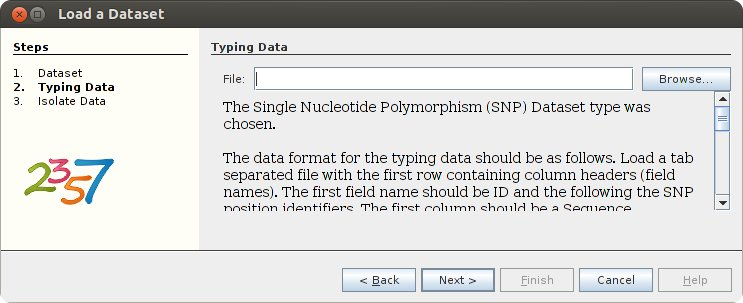
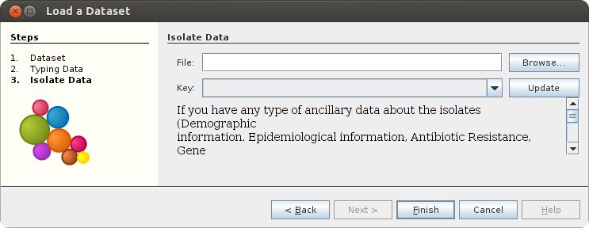
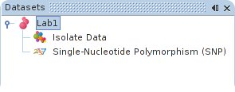
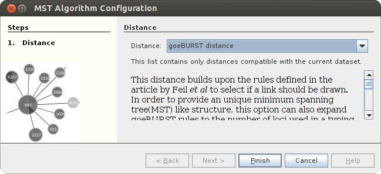
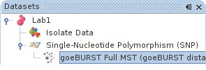
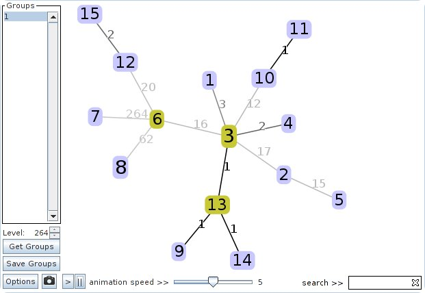
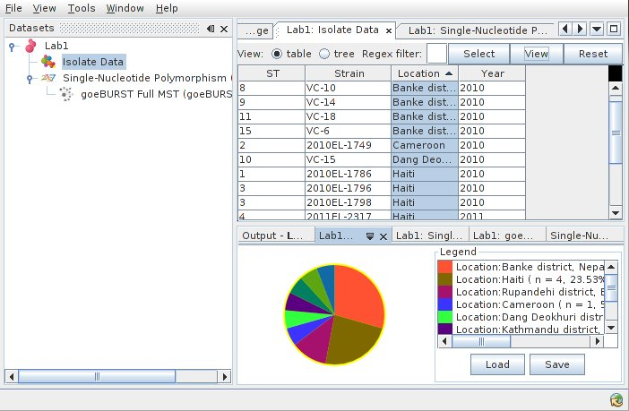

Minimum Spanning Tree with Phyloviz
===================================

Introduction
============

Tutorial
========

This tutorial will go through constructing a minimum spanning tree from SNP, MLST, and other typing data.  The software we will use for constructing these trees is [phyloviz](http://www.phyloviz.net).

Constructing a Working Directory
--------------------------------

To construct a working directory and obtain a copy of these instructions the following commands can be used.

	$ git clone http://gitlab.corefacility.ca/aaron.petkau/microbialinformatics2014.git
	$ cd microbialinformatics2014/mst-tutorial/
	$ ls
	images  lab1-snp-profile.tsv  lab1-snp-strains.tsv  PrepareInput.md  README.md

Starting Phyloviz
-----------------

In order to start phyloviz the following command can be entered in a terminal.

	$ phyloviz

This should launch phyloviz which should look similar to the following.


Lab 1: Minimum Spanning Tree with SNP Data
------------------------------------------

This lab will walk you through building a minimum spanning tree using SNP data.  The SNP data we will be using was generated using the methods described in the tutorial on [Core SNP Phylogenies](http://gitlab.corefacility.ca/aaron.petkau/microbialinformatics2014/blob/master/core-snp-tutorial/README.md).  In particular, the input file is the __pseudoalign-positions.tsv__ file, which was taken through the steps described at in [PrepareInput.md](PrepareInput.md).

Please follow the below steps to generate a minimum spanning tree.

### Step 1: Load Dataset

1. Click on **File > Load Dataset**

2. Name this dataset *Lab1*.  Set the **Dataset Type** to *SNP*.  When finished, click Next.  This should bring you to a **Typing Data** screen that looks similar to the following.

   

3. Click on **Browse...** and find the file *microbialinformatics2014/mst-tutorial/lab1-snp-profile.tsv*.  This file contains a set of sequence types (in column *ST*) defined based on the SNP data at different positions.  Click **Next** to continue.  This file looks similar to the following.

	```	
	ST  gi|360034408|ref|NC_016445.1|_17885  gi|360034408|ref|NC_016445.1|_28297
	1   T                                    A
	2   T                                    A
	3   T                                    A
	```
	
   The screen you should see looks similar to the following.

   

4. Click on **Browse...** and find the file *lab1-snp-strains.tsv*.  This file contains a mapping of the sequence types (in column *ST*) to strain ids.  Please make sure that the **Key** drop down menu is set to *ST* to indicate that this column contains the sequence types.  Click **Finish** to finish loading the data.  The file that was loaded looks similar to below.
	
	```
	ST  Strain
	1   2010EL-1786
	2   2010EL-1749
	3   2010EL-1796
	```
	
### Step 2: Examine Data

1. At the top-left in the **Datasets** panel you should see a *Lab1* tree item.  Click on this tree item to expand it.

   

2. Double-click on **Isolate Data**.  This will display the isolate data from the *lab1-snp-strains.tsv* in a table.

3. Double-click on **Single-Nucleotide Polymorphism (SNP)**.  This will display the SNP profile data from the *lab1-snp-profile.tsv* file in a table.

### Step 3: Run goeBURST

1. Right-click on the **Single-Nucleotide Polymorphism (SNP)** in the **Datasets** panel.  From here you should see an option to **Compute**.  Within the **Compute** menu click on **goeBURST Full MST**.  This should bring up a window that looks like the following.

   

2. Make sure the **Distance** is set to *goeBURST Distance* and click **Finish**.

3. In the **Datasets** panel you should see a new item **goeBURST Full MST**.  If you do not see this item you may have to expand **Single-Nucleotide Polymorphism (SNP)**.

   

### Step 4: View Results

1. Double-click on the **goeBURST Full MST** item in the **Datasets** panel.  This should open up a new tab on the right showing the minimum spanning tree.  You may have to click and drag (left-mouse) or zoom in or out (right-mouse-button) to get a good view.

2. You can adjust the quality of the image by clicking on the **Options** button and selecting *High Quality*.  You can also turn on the display of SNP distances between nodes in the tree by clicking on **Options** and selecting *Level labels*.  When finished you should see something similar to below.

   

### Step 5: Visualizing Data

1. Double-click on the **Isolate Data** item under the **Datasets** panel to the left.  This should bring up a table of the isolate data that was loaded from the **lab1-snp-strains.tsv** file.

2. We can select which categories of data to annotate on the minimum spanning tree from this view.  To annotate the *Location* data on to the minimum spanning tree, select all rows from the *Location* column.  Click on the **View** button at the top right.  This should display a pie chart giving a breakdown of the locations at the bottom.

   

3. Double-click on the **goeBURST Full MST** item in the **Datasets** panel.  This should bring you back to the minimum spanning tree view.  This should now be colored based on the location of each sequence type.

   

Questions
=========

1. Using a similar procedure as in *Step 5* annotate the minimum spanning tree with the year of collection instead of the location.  Which is the most common year represented?  Which is the least common year?

2. The *Level* selection can be used to define the maximum level nodes can be connected to be part of the same tree.  For the figure we generated, this can be interpreted as the maximum SNP distance to be considered part of the same closley related cluster.  Adjust the level to 20, or 15.  Which are the main strains that stand out?
